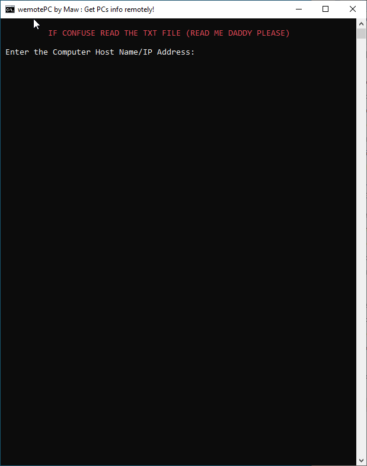
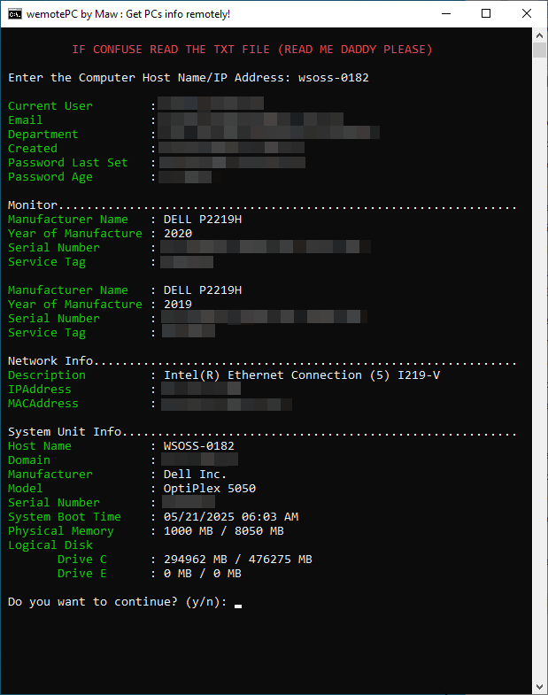

# Get Computer Info Remotely

Simple Powershell Script that will help to get remote computer information such as:

- Current User
- Email Address
- Department
- User Account Created
- User password last set
- User password age
- Monitor's manufacturer name
- Monitor's year manufactured
- Monitor's Serial Number
- Monitor's Service Tag
- Network Description
- IP Address
- Mac Address
- Hostname
- Domain
- Manufacturer of System Unit
- Model of System Unit
- Serial Number of System Unit
- System Boot Time
- Physical Memory
- Logical Memory

## Language Used:
- Powershell

## Requirements:
- Powershell
- Powershell ISE
- Command Prompt
- Connected to domain
- Administrator Privileges

## Sample Screenshots
### Sample Picture
  
  
### Sample Picture
  
